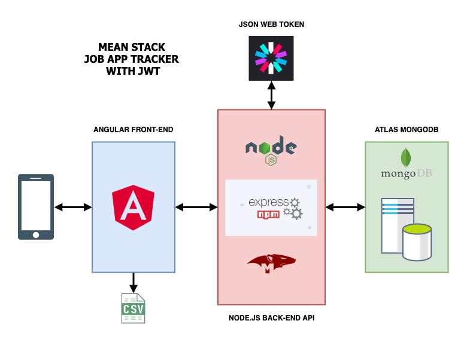

# Job App Tracker
## Introduction
Its easy to lose track of job applications - this single page web application provides a simple way to keep track of all your job application data.

App link: [Job App Tracker](https://secret-anchorage-18681.herokuapp.com) 

### Key Features:

* Register
* Login
* Create, update and delete jobs applications
* Add notes to your job applications
* Export your job record to CSV for Excel spreadsheets
* Login in as admin user

## Technologies
The application is built using the MEAN (MongoDB, ExpressJS, Angular, NodeJS) stack - a modern open source and highly efficient development framework that allows the coder to use JavaScript on both the frontend and backend. 
> The MEAN stack allows for the seamless transfer of data from one layer to another in JSON format.

### Project created with:
* Angular 8
* ExpressJS
* NodeJS
* MongoDB

#### Other Key Dependencies:
* MongooseJS
* Angular Material 
* JSON Web Tokens

#### Deployment:
* Heroku
* MongoDB Atlas 

#### Architecture

The project is deployed as two separate applications:

1. Angular frontend (ExpressJS server)
2. NodeJS API backend (ExpressJS server)

* The MongoDB database is hosted on MongoDB Atlas
  
## Launch

* Angular frontend app - use Angular CLI and command `ng serve` to build and serve. 
* NodeJS backend app - use NPM with command `npm run start-dev` to start development server. 

## References

The project uses various resources, in particular:

* [Angular 8 - User Registration and Login Example](https://jasonwatmore.com/post/2019/06/10/angular-8-user-registration-and-login-example-tutorial)

* [NodeJS + MongoDB - Simple API for Authentication, Registration and User Management](https://jasonwatmore.com/post/2018/06/14/nodejs-mongodb-simple-api-for-authentication-registration-and-user-management)

